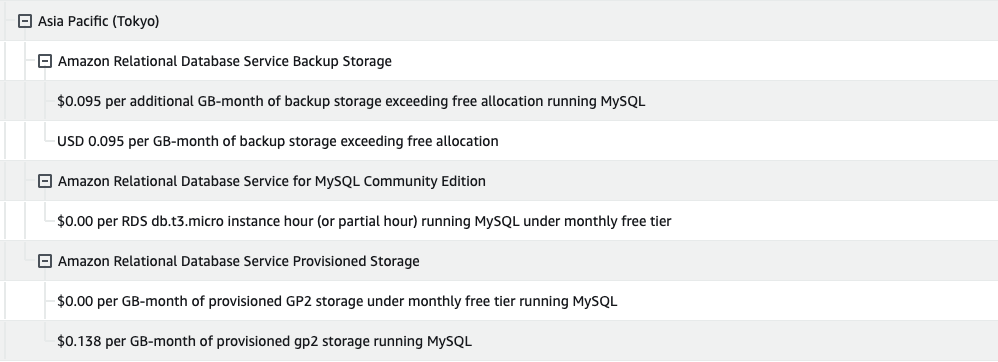
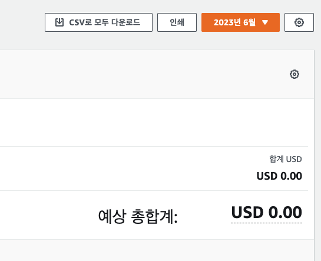
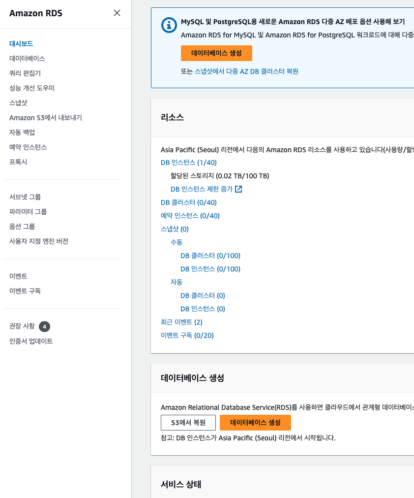
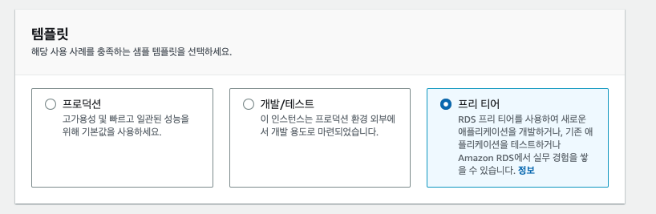
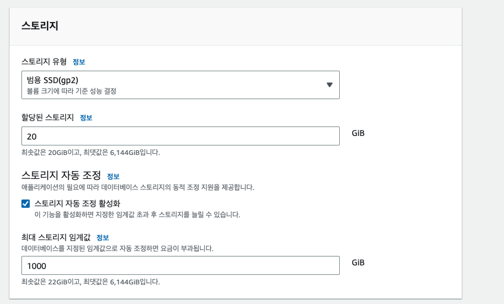

 
 

안녕하세요! 도도히 입니다!  어느날 방심하던 사이에 aws 에서 돈을 8천원씩 뜯어가길래..뭐지..?했는데 
알고보니 rds 프리티어 셋팅을 잘못해놔서 였습니다....  
매일매일 aws 청구서 보면서 관찰하면서 RDS를 4번 정도 만들고 지우고를 반복했었답니다😇

 

***

 

# 💸 RDS 셋팅할때 스토리지 자동 조정 되어있었다.

 
내가 감당해야했던 RDS 에서 빠져나가는 비용.. 
* 4월달에 4.50 달러
* 5월달에 3.78 달러

돈이 빠져나간다는걸 늦게 인지해서 뒤늦게 청구비를 막기 시작했다. 
일단 뭐 때문에 돈이 빠져나갔던건지 살펴보자😞

> 0.138 per GB-month of provisioned gp2 storage running MySQL

찾아보니 인스턴스 2개 생성시, 또는 rds 옵션 중 스토리지 자동 조정 때문이었다.

하지만 이런 이유인지도 모르고, aws 셋팅을 처음 해봤던 나는 보니까 도쿄로 설정되어있어서 그런줄 알고
얼른 만들었던 rds, ec2 다 삭제해버렸다...(아까운 내 코드들...)

 

# 💸 RDS 셋팅할때 백업 자동화 설정 되어있었다.

> $0.095 per additional GB-month of backup storage exceeding free allocation running MySQL

RDS 셋팅 할때 백업이 자동으로 활성화 되어있는 경우가 많다. 
그래서 나도 모르는 스냅샷이 자동으로 생성되면서 스냅샷 안 지워서 생긴 비용 같았다.
 

자 이제 다 지웠으니까 돈은 나가지 않았을 것이다. 
하지만 이렇게 해결하면 안되기 때문에 얼른 다시 rds를 셋팅했다.

 

# 💡 과금이 발생하지 않는 Free-tier로 RDS 만들어보기
 

RDS 프리티어 셋팅하기를 차근차근 따라하니 
놀랍게도 6월달 청구서는 0원이었다. 
아직까진 6월 청구서는 좀 더 지켜봐야겠지만.. 

> [자세한 설명은 이 링크를 참고해주세요](https://velog.io/@shawnhansh/AWS-RDSmySql-%ED%94%84%EB%A6%AC%ED%8B%B0%EC%96%B4-%EC%83%9D%EC%84%B1%ED%95%98%EA%B8%B0)

참고로 AWS free-tier 는 처음 사용한 계정만 가능하고 1년까지 무료로 쓸 수 있다.
대신 나처럼, free-tier에서 제공하는 셋팅보다 오버스펙이거나, 사용량이 넘으면 과금이 될 수 있다.

### 1. AWS RDS 진입 후 데이터베이스 생성

AWS 검색창에 RDS를 입력해서 RDS 서비스로 접근한다.
그리고 상단에 떠있는 `데이터베이스` 생성을 클릭한다.

요렇게 Rds 들어가면 데이터베이스 버튼이 많이 생성되어 있다.

### 2. 원하는 엔진 옵션 클릭

난 MySQL로 만들었다. 회사에서도 Mysql를 썼고, 잘 다룰 수 있는 DB로 선택해주면 된다.

### 3. 템플릿 프리티어 선택 (중요✨)

프리티어로 선택을 해줘야 프리티어로 쓰겠다는 것과 같다.

### 4. DB 인스턴스 설정

* DB 인스턴스 식별자 : DB 이름 지어주기
* 마스터 이름 : 관리하는 사람 이름 지어주기
* 마스터 암호 : DB 접근 암호

### 5. 인스턴스 구성

기본값으로 셋팅해도 된다.
원래는 t2로 선택해야하는 것 같았는데, 바뀐건지 t3도 프리티어로 제공한다고 aws 공식문서에 나와있다.

### 6. 스토리지 자동 조정 활성화 해제 (중요✨)

진짜 여기가 미친 중요함이다.
내가 처음에 셋팅할땐 저 할당된 스토리지 값도 20이 아니어서 돈이 나왔던 것 같은데 지금은 할당된 스토리지 20으로 잘 셋팅 되어있다.

무조건 스토리지 자동 조정 체크박스 눌러서 비활성화 시켜야한다. 
안그럼 저처럼 돈이 청구 됨😭

### 7. 연결

여기선 나머지는 다 기본값으로 두고, 퍼블릭 엑세스 정보만 예로 해놓는다.

### 8. 추가구성에서 자동 백업 활성화 해제 (중요✨)

자동 백업 활성화 하라는 블로그 블도 봤는데,, 저는 스냅샷에서 돈이 청구되서
자동 백업 활성화는 해제하는 것이 좋을 것 같다고 생각했습니다

### 9. 데이터베이스 생성 버튼 클릭 후 끝

설명하지 않은 부분들은 기본 값으로 셋팅해주면 된다!

  

블로그까지 찾아와주신 분들에게 도움이 되었음 좋겠습니다!🙇‍♀️ 

  
